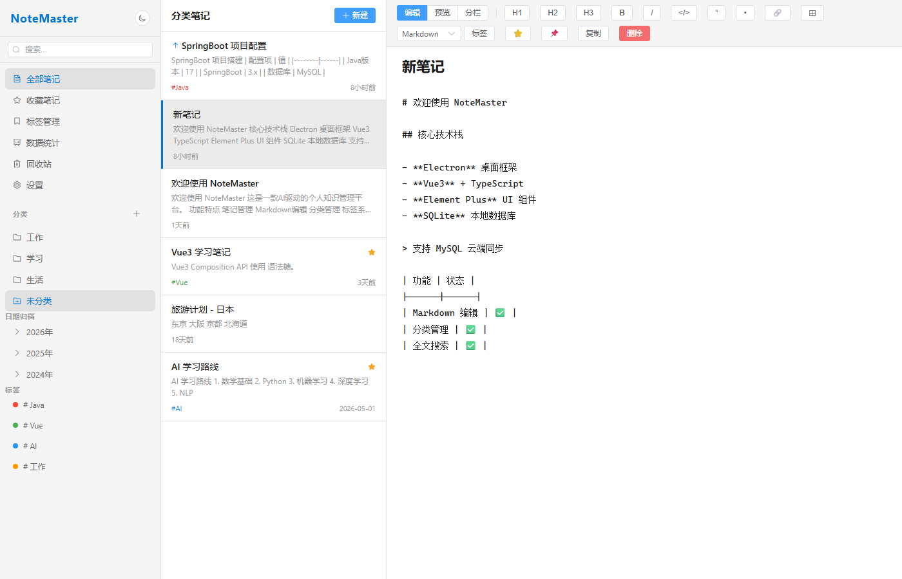
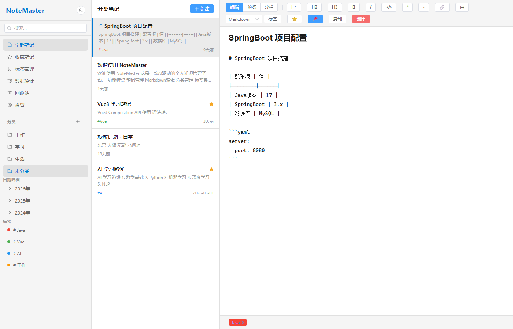
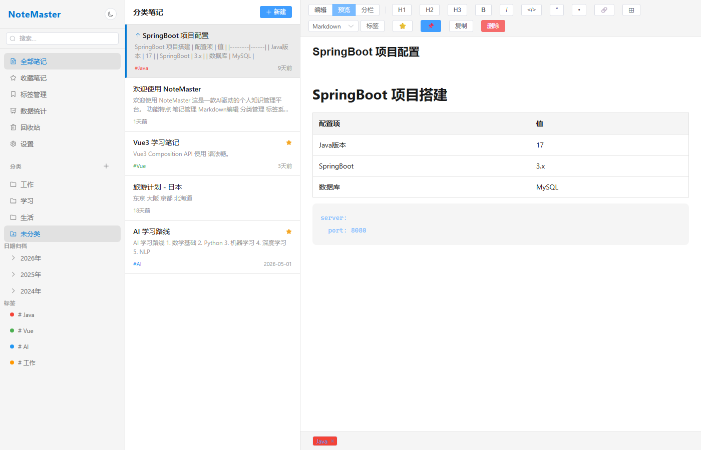
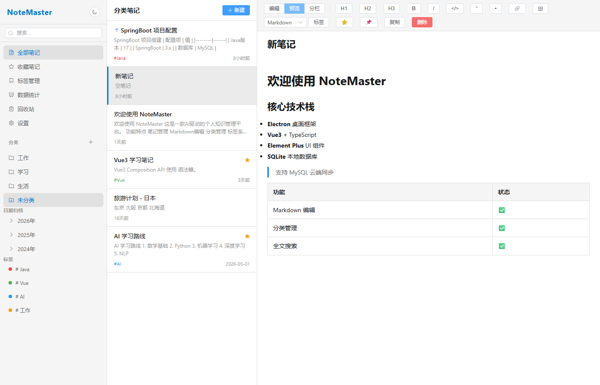
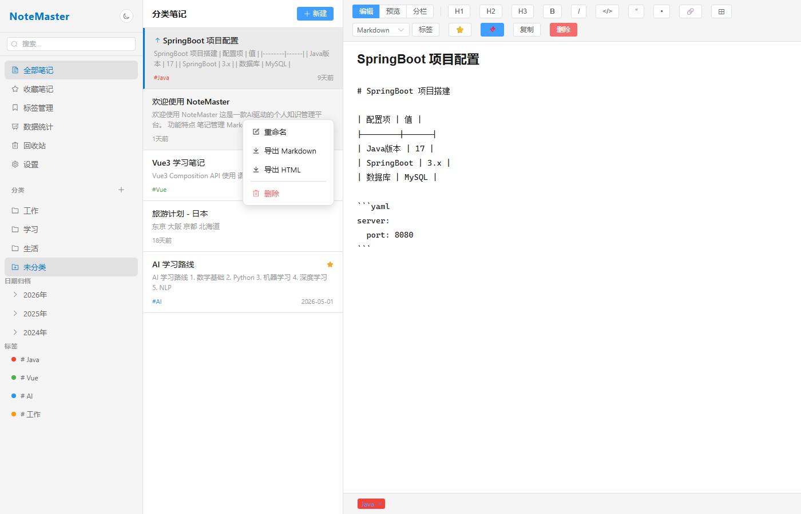
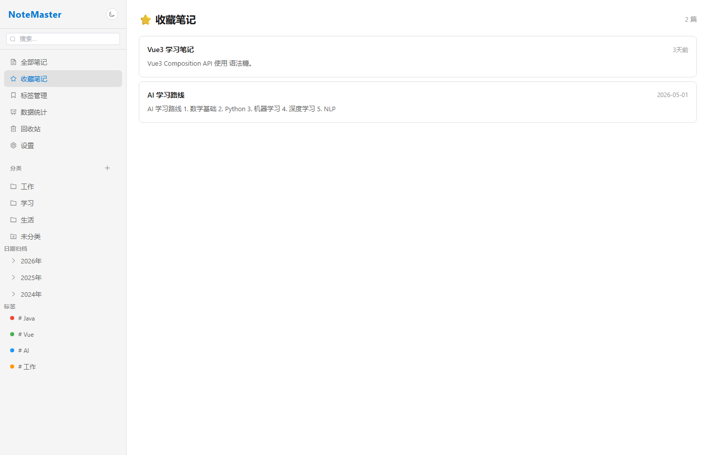
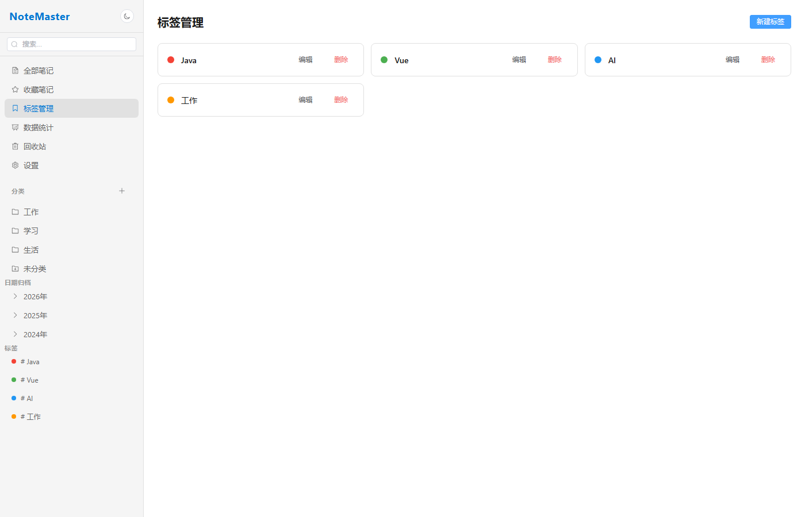
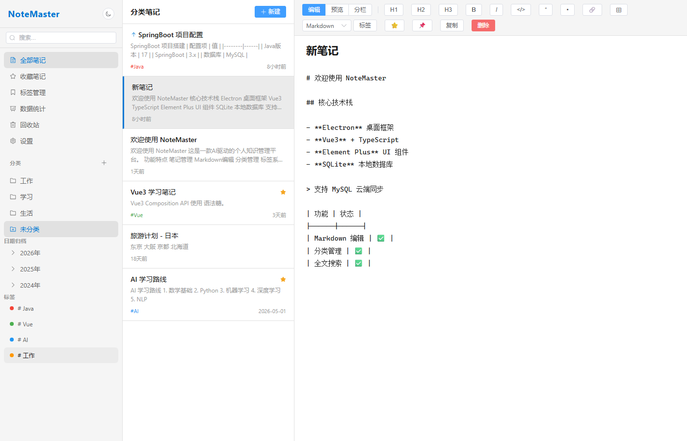
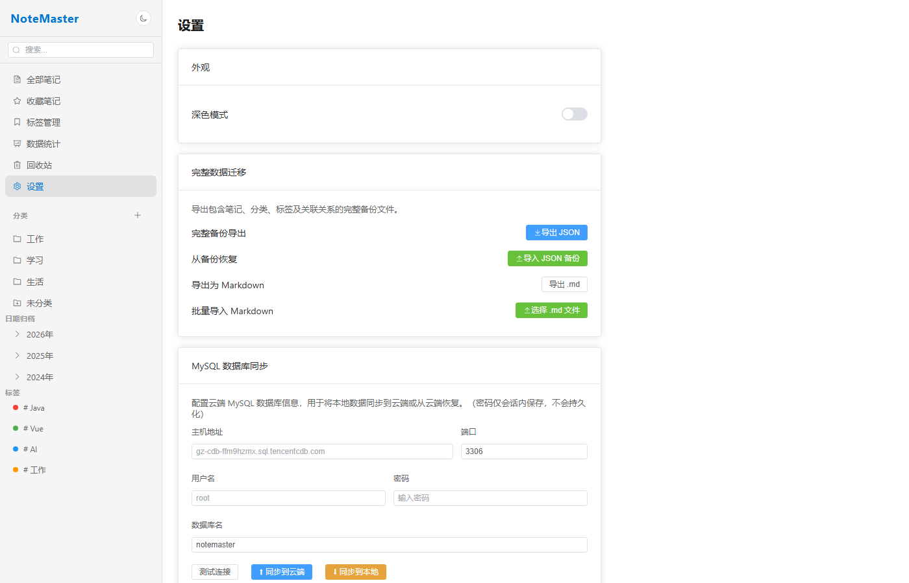
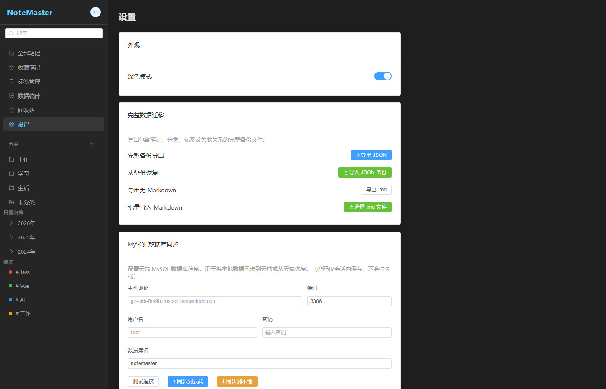

# NoteMaster

<div align="center">

**AI 驱动的个人知识管理平台 — Windows 桌面版**

[](https://www.electronjs.org/)
[](https://vuejs.org/)
[](https://www.typescriptlang.org/)
[](https://element-plus.org/)
[](https://www.sqlite.org/)

</div>

---

## 项目简介

NoteMaster 是一款 **本地优先** 的 Windows 桌面笔记软件，融合 Markdown 编辑、无限层级分类管理、全文搜索、数据统计等功能。支持可选的 **SSH/SFTP 云服务器同步**，一键打包为 `.exe`，开箱即用。

---

## 环境要求

| 要求 | 最低版本 |
|------|---------|
| 操作系统 | Windows 10 / 11 |
| Node.js | >= 18（当前测试版本 v24.11.1） |
| npm | >= 9（**推荐 10.x**；npm 11 存在已知 semver 解析 bug） |
| 磁盘空间 | 约 2 GB（node_modules + 构建产物） |

---

## 快速开始 — 安装与开发

### 1. 安装依赖

```powershell
cd NoteMaster
npm install
```

> ⚠️ **如果 `npm install` 报错 `Invalid Version`：** 这是 npm 11 的已知 bug，先降级 npm 再安装：
>
> ```powershell
> npm install -g npm@10
> npm install
> ```

### 2. 启动开发模式

```powershell
npm run dev
```

> 首次启动时，应用自动在 `%APPDATA%\notemaster\notemaster.db` 创建数据库，并预置 **5 篇示例笔记** 和 **3 个默认分类**（工作 / 学习 / 生活）。

### 3. 代码检查（可选）

```powershell
npm run lint          # ESLint 自动修复
npm run typecheck     # TypeScript 类型检查
```

---

## 打包与构建

### 推荐：使用 `build.ps1` 一键构建

```powershell
.\build.ps1                     # 快速模式 — 解压目录（仅验证用）
.\build.ps1 -installer          # 生成 NSIS .exe 安装包
.\build.ps1 -check              # 构建前先 typecheck + lint
.\build.ps1 -clean              # 仅清理历史构建产物
.\build.ps1 -installer -check   # 完整检查 + 安装包
```

**构建流程：**

| 步骤 | 说明 |
|------|------|
| 1. 环境检测 | 验证 Node.js、electron-vite、electron-builder 是否就绪 |
| 2. 修复 npm 隔离 | 将 npm `.package-hash` 缓存目录中的文件同步到扁平 `node_modules` |
| 3. Electron 二进制 | 缺失时自动通过国内镜像下载 `electron.exe` |
| 4. 预检查（可选） | `vue-tsc --noEmit` + ESLint |
| 5. 编译源码 | `electron-vite build` → `out/` + `dist/` |
| 6. 打包 | `electron-builder` → `output-YYYYMMDD-HHmmss/` |
| 7. 清理 | 删除 `out/`、`dist/`、临时配置文件 |
| 8. 输出结果 | 打印 .exe 路径和文件大小 |

**输出产物：**

```
output-20260615-123456/
└── win-unpacked/
    └── NoteMaster.exe          （约 220 MB，解压目录模式）

# 使用 -installer 参数：
output-20260615-123456/
└── NoteMaster Setup 1.0.0.exe  （NSIS 安装包）
```

### 手动构建（备选方案）

```powershell
npm run build                              # 仅编译
npx electron-builder --dir                 # 打包为解压目录
npx electron-builder                       # 或：打包为 NSIS 安装包
```

---

## 功能概览

| 功能 | 说明 |
|------|------|
| 📝 Markdown 编辑 | 左右分栏实时预览，支持标题/表格/代码块/引用/图片/链接 |
| 📂 无限层级分类 | 拖拽排序、右键菜单、收藏文件夹、嵌套任意深度 |
| 👁️ **父分类聚合显示** | **点击父分类时自动显示所有子分类的笔记，并标注来源子文件夹** |
| 🏷️ 标签系统 | 多标签、自定义颜色（弹窗选择）、标签搜索 |
| 🎨 **标签文字优化** | **标签弹窗中文字加粗放大，固定白色字体，提升可读性** |
| 🔍 全文搜索 | 标题+内容模糊搜索、关键词高亮、搜索历史 |
| 📊 数据统计 | ECharts 图表：分类分布饼图 + 月度创建趋势柱状图 |
| 📅 日期归档 | 按年/月自动归档筛选 |
| 🗑️ 回收站 | 软删除、恢复、彻底删除 |
| 📋 批量删除 | 批量模式，勾选多篇笔记一键删除 |
| ⭐ 收藏 & 置顶 | 笔记收藏、置顶排序 |
| 🌙 深色模式 | 浅色/深色一键切换，支持跟随系统 |
| 📁 拖拽移动 | 拖拽笔记到分类文件夹、拖拽文件夹调整层级 |
| 💾 数据导入/导出 | 支持 JSON 格式全量导入导出、Markdown 文件批量导入 |
| 📦 **分类 ZIP 导出** | **右键分类导出为 ZIP 压缩包，保留完整文件夹层级结构** |
| 🖼️ **文件空间管理** | **侧边栏显示所有上传文件，按分类折叠，标记引用状态** |
| 🚫 **文件大小限制** | **粘贴/上传图片自动限制 1MB，防止大文件占用空间** |
| 📊 **进度条反馈** | **导出备份和 SSH 上传时显示实时进度，提升用户体验** |
|  图片粘贴 | 编辑器内粘贴图片自动保存本地，相对路径引用 |
| 📜 历史版本 | 每次保存自动生成快照，可回滚任意历史版本 |
| 🔄 云同步 | SSH/SFTP 同步数据库 + 图片文件到远程服务器 |
| ⌨️ 快捷键 | `Ctrl+Shift+F` 全局搜索对话框 |
| 🖥️ 系统托盘 | 关闭窗口 → 最小化到托盘，点击托盘恢复，右键托盘退出 |
| 🧭 **智能右键菜单** | **菜单自动检测窗口边界，避免溢出导致无法操作** |
| 📂 **外部文件浏览器** | **类似 VSCode 的文件浏览器，直接打开文件夹查看目录和文件，支持懒加载、预览、编辑和排序** |

---

## 界面展示

### 主页 — 三栏布局



> **左栏**：分类树 + 日期归档 + 标签列表 → **中栏**：笔记列表 → **右栏**：Markdown 编辑器

### Markdown 编辑器



> 顶部工具栏支持 H1~H3、粗体、斜体、代码块、引用、列表、链接、表格

### 实时预览



> Markdown → HTML 实时渲染，支持表格、代码高亮、引用等

### 新建笔记



> 粘贴图片自动保存到 `notemaster-data/files/`，笔记中存储相对路径引用

### 笔记右键菜单



> 右键笔记：**重命名 / 导出 Markdown / 导出 HTML / 删除**

### 收藏笔记



> 收藏的笔记集中展示

### 标签管理

#### 更换标签颜色

1. 右键标签 → **「更换颜色」**
2. 弹出颜色选择对话框，显示 8 种预设颜色（蓝、绿、橙、红、灰、紫、粉、青）
3. 点击颜色卡片选择，当前选中颜色带蓝色边框高亮
4. 点击「确定」应用新颜色



#### 标签文字优化

- 标签管理弹窗中的文字已优化：**字体加粗（600）、字号增大（14px）、固定白色字体**
- 无论背景色深浅，文字始终保持清晰可见
- 标签尺寸从 `small` 升级为 `large`，更易点击

### 分类树 — 右键菜单



> 右键文件夹：**新建子文件夹 / 重命名 / 收藏 / 导出 ZIP / 删除**
> 
> 支持拖拽笔记到分类、拖拽文件夹调整层级

### 父分类聚合显示

当点击一个包含子分类的父分类时：
- ✅ 中间列表区域会显示该父分类及其所有子分类下的笔记
- ✅ 每篇来自子分类的笔记底部会显示蓝色徽章，标注来源子文件夹名称（如 `📁 前端`）
- ✅ 方便快速浏览整个分类体系的内容

### 智能右键菜单定位

- ✅ 右键菜单自动检测窗口边界
- ✅ 如果菜单会超出底部，自动向上移动
- ✅ 如果菜单会超出右侧，自动向左移动
- ✅ 确保所有菜单项始终可见且可操作

### 文件空间管理


> **侧边栏底部**：点击「文件空间」展开，按分类折叠显示所有上传文件，标记引用状态

### 进度条反馈


> **导出/上传时**：实时显示进度百分比、状态文本和具体数值

### 设置页 — 云同步



> SSH/SFTP 配置，支持密码和私钥两种认证方式

### 深色模式



> 浅色/深色一键切换

---

## 操作指南

### 创建笔记

1. 在左侧分类树选择一个分类（如「工作」）
2. 点击笔记列表顶部的 **「新建」** 按钮
3. 右侧编辑器自动切换为新笔记，输入标题和内容
4. 内容自动保存到当前选中分类

> 如果未选择分类，新建笔记将归入「未分类」。

### 文件夹管理

| 操作 | 方法 |
|------|------|
| 新建根分类 | 点击分类栏右侧 **「+」** 按钮，输入名称 |
| 新建子文件夹 | 右键目标文件夹 → **「新建子文件夹」** |
| 重命名 | 右键文件夹 → **「重命名」** |
| 收藏文件夹 | 右键文件夹 → **「收藏文件夹」**（出现在 ⭐ 收藏区） |
| 移动文件夹 | 拖拽文件夹到目标位置 |
| 删除文件夹 | 右键文件夹 → **「删除」**（其下笔记变为未分类） |

### 拖拽操作

| 操作 | 方法 |
|------|------|
| 移动笔记到分类 | 拖拽笔记卡片到左侧分类名称上 |
| 调整分类层级 | 拖拽文件夹到另一个文件夹上，成为其子文件夹 |

### 批量删除

1. 点击笔记列表顶部 **「批量」** 按钮，进入批量模式
2. 勾选需要删除的笔记（或点击 **「全选」**）
3. 点击 **「删除 (N)」** → 确认 → 所选笔记移入回收站
4. 在回收站可恢复或彻底删除

### 导出笔记

- **导出 Markdown**：右键笔记 → **「导出 Markdown」** → 下载 `.md` 文件
- **导出 HTML**：右键笔记 → **「导出 HTML」** → 下载 `.html` 文件
- **导出分类（ZIP）**：右键文件夹 → **「导出 .md」** → 生成 ZIP 压缩包，包含该分类及所有子分类的笔记，保留完整的文件夹层级结构
  - 例如：「学习」分类下有「前端」「后端」两个子分类，导出的 ZIP 包内会包含 `学习/前端/笔记1.md`、`学习/后端/笔记2.md` 等路径
  - 导出过程显示进度条，大数量导出有明确反馈

### 文件空间管理

侧边栏底部新增「文件空间」区域，集中管理所有上传的图片文件：

1. **展开文件空间**
   - 点击「文件空间」右侧箭头按钮展开
   - 显示文件总数和总大小统计

2. **按分类查看文件**
   - 文件自动按所属分类分组显示
   - 每个分类显示文件数量徽章
   - 点击分类标题可折叠/展开
   - 未引用的文件归入「未引用」分类

3. **文件信息展示**
   - 文件名（过长时省略，悬停显示完整路径）
   - 文件大小（KB/MB/GB 自动格式化）
   - 引用状态标签（绿色=已引用，灰色=未引用）
   - 按修改时间排序（最新的在前）

4. **性能优化**
   - 默认最多显示 100 个文件
   - 滚动条最大高度 300px
   - 大量文件时界面依然流畅

### 文件大小限制

为防止大文件占用过多空间，系统对上传/粘贴的图片进行大小限制：

- **限制大小**：1 MB（1,048,576 字节）
- **适用范围**：所有图片粘贴和文件上传操作
- **超限处理**：显示错误提示，包含实际文件大小
- **建议**：在外部压缩图片后再使用，或使用 JPG 格式代替 PNG

> ⚠️ Base64 编码会使文件大小增加约 33%，750KB 的图片编码后接近 1MB。

### 进度条反馈

在执行耗时操作时，系统会显示实时进度对话框：

#### 完整备份导出

1. 进入 **设置页** → 数据备份
2. 点击 **「导出完整数据」**
3. 弹出进度对话框，显示：
   - 进度条百分比（0%~100%）
   - 当前状态文本（如“正在处理图片 50/100”）
   - 具体数值（已完成 / 总数）
4. 完成后自动关闭，下载 ZIP 文件

#### SSH 云同步上传

1. 配置好 SSH 连接信息
2. 点击 **「⬆ 同步到云端」**
3. 确认对话框 → 弹出进度对话框
4. 显示数据库上传进度和文件上传进度
5. 完成后显示成功消息和最后同步时间

> 💡 进度条期间不能关闭窗口，防止中断操作导致数据不一致。

### 数据备份

1. 进入 **设置页**
2. 使用 **「导出全部数据 (JSON)」** 导出完整数据库
3. 使用 **「导入 JSON」** 恢复数据
4. 也可使用 **「导入 Markdown 文件」** 批量导入 `.md` 文件

### 图片缓存管理

定期清理未引用的图片文件，释放磁盘空间：

1. 进入 **设置页** → 图片缓存管理
2. 点击 **「清除未引用文件」**
3. 预览将被删除的文件列表
4. 确认后执行删除，显示删除数量和释放空间大小
5. 查看详细日志，了解清理过程

> 💡 建议每月执行一次清理，保持存储空间整洁。

### 外部文件浏览器

类似 VSCode 的轻量文件浏览器，无需导入数据库，直接读取文件系统浏览目录和文件。

#### 打开文件夹

1. 点击菜单栏：**文件** → **打开文件夹**（快捷键 `Ctrl+Shift+O`）
2. 选择要浏览的文件夹
3. 侧边栏底部「外部文件」区域自动显示目录结构

#### 显示规则

- **文件夹优先**：所有文件夹统一显示在文件上方
- **文件在后**：所有文件显示在文件夹下方
- **扁平化根目录**：文件和文件夹直接显示在根目录，无虚拟节点包裹
- **懒加载**：点击文件夹时才加载子目录内容，避免一次性加载大量数据

#### 文件显示结构

```
外部文件 (X)
├─ 📂 book/              ← 文件夹在前
├─ 📂 文档整理/          ← 文件夹在前
├─ 📄 file1.txt          ← 文件在后
├─ 📄 file2.md           ← 文件在后
└─ 📄 readme.md          ← 文件在后
```

#### 文件操作

| 操作 | 方法 |
|------|------|
| 展开/收起文件夹 | 点击文件夹名称 |
| 预览文件 | 点击文件项（支持文本格式：`.md`、`.json`、`.txt`） |
| 用系统程序打开 | 点击文件右侧的文件夹图标按钮 |
| 拖拽文件 | 拖拽文件项到编辑器等区域 |

#### 技术实现

- **后端**（`ipc.ts`）：使用 Node.js `readdirSync` 直接读取文件系统，无需数据库
- **前端**（`ExternalFileTree.vue`）：递归组件渲染，区分纯文件节点和文件夹节点
- **ID 生成**：使用文件路径的 hash 值作为临时 ID
- **路径规范**：内部统一使用 `/` 分隔符，兼容 Windows 的 `\`

### 云同步（SSH/SFTP）

1. 进入 **设置页** → 云服务器同步区域
2. 填写服务器信息：主机、端口、用户名、密码或私钥
3. 点击 **「测试连接」** 验证配置
4. 点击 **「⬆ 同步到云端」** 上传数据
5. 点击 **「⬇ 同步到本地」** 下载并覆盖本地数据

> ⚠️ 密码和私钥仅在内存中保存，不会持久化到磁盘。

---

## 项目结构

```
NoteMaster/
├── src/
│   ├── main/                    # Electron 主进程
│   │   ├── index.ts             # 入口 — 托盘、快捷键、生命周期
│   │   ├── window.ts            # 窗口管理（关闭 → 最小化到托盘）
│   │   ├── ipc.ts               # IPC 处理器（CRUD、搜索、同步、退出）
│   │   ├── database.ts          # SQLite 数据库（初始化、迁移、种子数据）
│   │   └── sftp.ts              # SSH/SFTP 云同步
│   ├── preload/
│   │   └── index.ts             # contextBridge 安全 API 桥接
│   ├── shared/
│   │   └── types.ts             # TypeScript 共享类型定义
│   └── renderer/
│       ├── index.html           # 启动欢迎页 + 加载动画
│       ├── main.ts              # Vue 入口（开发模式自动启用 Mock API）
│       ├── App.vue
│       ├── router/index.ts
│       ├── stores/              # Pinia 状态管理：note、category、tag、search、ui
│       ├── views/               # 页面：首页、收藏、标签、搜索、统计、回收站、设置
│       ├── components/
│       │   ├── layout/          # AppLayout、AppSidebar、CategoryTreeItem、ExternalFileTree
│       │   ├── note/            # NoteList
│       │   ├── editor/          # MdEditor
│       │   └── common/          # GlobalSearchDialog
│       ├── utils/               # 工具函数（格式化、Markdown 处理）
│       └── assets/styles/       # 全局样式
├── resources/                   # icon.png（应用图标 & 托盘图标）
├── screenshots/                 # 界面截图
├── build.ps1                    # 一键构建脚本（推荐）
├── electron-builder.yml         # electron-builder 打包配置
├── electron.vite.config.ts      # electron-vite 构建配置
└── package.json
```

---

## 数据库

本地 SQLite 数据库文件：`%APPDATA%\notemaster\notemaster.db`

> 备用路径：如果主路径不可用，使用安装目录下的 `notemaster-data\notemaster.db`

| 表名 | 字段 | 说明 |
|------|------|------|
| `notes` | id, title, content, content_type, category_id, is_favorite, is_pinned, is_deleted, created_at, updated_at | 笔记主表 |
| `categories` | id, parent_id, name, sort_order, is_favorite | 分类树（parent_id 实现无限层级） |
| `tags` | id, name, color | 标签 |
| `note_tags` | note_id, tag_id | 笔记-标签多对多关联 |
| `note_versions` | note_id, title, content, version, created_at | 每次保存生成历史版本快照 |
| `search_history` | keyword, searched_at | 搜索历史 |

---

## 云同步

### 同步内容

| 操作 | 说明 |
|------|------|
| ⬆ 上传 | 推送 `notemaster.db` + 笔记中引用的图片文件 → 远程服务器 |
| ⬇ 下载 | 拉取远程数据库 + 全部文件 → 覆盖本地 |

### 远程目录结构

```
/notemaster-data/
├── notemaster.db          # SQLite 数据库
└── files/                 # 图片/附件
    ├── note_1_xxx.png
    └── note_2_xxx.jpg
```

---

## 技术栈

| 层级 | 技术 |
|------|------|
| 桌面框架 | Electron 42 |
| 前端 | Vue 3.5 + Pinia 3 + Vue Router 5 |
| UI | Element Plus 2.14 + 自定义 CSS |
| 语言 | TypeScript 5.7（严格模式） |
| 构建 | electron-vite 5 + Vite 7 |
| 打包 | electron-builder 26（NSIS 安装包） |
| 数据库 | sql.js（SQLite 编译为 WASM，无需额外安装） |
| Markdown | markdown-it 14 + highlight.js 11 |
| 图表 | ECharts 6 + vue-echarts 8 |
| SSH/SFTP | ssh2-sftp-client 12 |
| 图标 | @element-plus/icons-vue |

---

## 常见问题

### `npm install` 报错 `Invalid Version`

npm 11 存在 semver 解析 bug，降级到 npm 10：

```powershell
npm install -g npm@10
npm install
```

### `electron-vite` 命令找不到

npm 10+ 的 `node_modules/.bin` 中文件名带哈希后缀，`npx` 无法识别。使用 `build.ps1` 直接通过 Node.js 调用脚本入口，或手动执行：

```powershell
node node_modules\electron-vite\bin\electron-vite.js build
```

### 打包时 `Cannot find module`

npm 隔离模式下部分包文件不完整。`build.ps1` 第 2 步自动修复此问题。

### 创建笔记报错 `An object could not be cloned`

Vue 的响应式 Proxy 对象无法通过 Electron IPC 结构化克隆。项目已在所有 store 的 API 调用中使用 `toPlain()` 函数（JSON 序列化/反序列化）处理。

### `electron.exe` 找不到

`build.ps1` 会自动从 `npmmirror.com` 下载。如果仍然失败：

```powershell
$env:ELECTRON_MIRROR = "https://npmmirror.com/mirrors/electron/"
node node_modules\electron\install.js
```

### 文件空间显示的文件数量与实际不符？

文件空间最多显示 100 个文件，这是为了避免性能问题。如需查看全部，请使用「设置 > 图片缓存管理」功能。

### 为什么有些文件显示“未引用”但仍在使用？

可能原因：
- 文件在已删除的笔记中使用
- 文件在草稿中使用但未保存
- 正则表达式未能匹配特殊的引用格式

建议定期清理未引用文件，释放存储空间。

### 粘贴图片时提示“文件大小超过限制”？

系统限制单个图片不超过 1MB。解决方法：
1. 使用在线工具压缩图片（如 TinyPNG）
2. 调整图片分辨率（800-1200px 宽度足够）
3. 使用 JPG 格式代替 PNG（更小）
4. 降低图片质量（70-80% 即可）

> ⚠️ Base64 编码会使文件大小增加约 33%，请预留余量。

### 进度条卡在某个百分比不动？

可能原因：
- 网络不稳定（SSH 上传）
- 文件太大，处理时间长
- 系统资源不足

建议：
1. 检查网络连接
2. 查看任务管理器，确认 CPU/内存使用情况
3. 等待一段时间，大文件处理需要时间
4. 如长时间无响应，可重启应用重试

### 导出的 ZIP 文件中图片路径不对？

确保使用的是最新版本的导出功能。ZIP 结构应该是扁平化的：

```
分类名-10篇笔记.zip
├─ 笔记1.md
├─ 笔记2.md
└─ images/
    ├─ note_37_xxx.jpeg
    └─ embedded_0.png
```

MD 文件和 images 文件夹都在 ZIP 根目录，相对路径 `` 能正常工作。

---

## 快捷键

| 按键 | 功能 |
|------|------|
| `Ctrl+Shift+F` | 唤起全局搜索对话框 |

---

## License

MIT
