# AmNote UI 自动化测试报告

> 生成时间：2026-06-25 10:38:07
> 测试环境：Chromium 浏览器 (1440x900)
> 测试地址：http://localhost:5173

## 测试概览

| 指标 | 值 |
|------|-----|
| 总测试项 | 57 |
| 通过 | 57 |
| 失败 | 0 |
| 通过率 | 100.0% |

## 测试结果总览

| 状态 | 测试项 | 描述 | 详情 |
|------|--------|------|------|
| PASS | 首页-侧边栏 | 侧边栏渲染正常 |  |
| PASS | 首页-笔记列表 | 笔记列表区域渲染正常 |  |
| PASS | 首页-编辑器区域 | 编辑器区域渲染正常 |  |
| PASS | 01-home | 首页 - 笔记列表与编辑器布局 |  |
| PASS | 侧边栏-菜单项 | 发现 7/7 个菜单项 |  |
| PASS | 侧边栏-分类区域 | 分类区域显示正常 |  |
| PASS | 侧边栏-分类列表 | 发现 3 个分类项 |  |
| PASS | 侧边栏-标签区域 | 标签区域显示正常 |  |
| PASS | 侧边栏-标签列表 | 发现 4 个标签项 |  |
| PASS | 侧边栏-日期归档 | 日期归档区域显示正常 |  |
| PASS | 02-sidebar | 侧边栏 - 导航菜单、分类树、标签 |  |
| PASS | 笔记选择 | 点击笔记项成功 |  |
| PASS | 编辑器 | 编辑器渲染正常 |  |
| PASS | 03-note-editor | 笔记编辑器 - 选中笔记后显示编辑区域 |  |
| PASS | 收藏页面-标题 | 收藏页面标题显示正常 |  |
| PASS | 收藏页面-笔记列表 | 发现 2 篇收藏笔记 |  |
| PASS | 04-favorites | 收藏笔记页面 |  |
| PASS | 标签页面-标题 | 标签管理页面标题显示正常 |  |
| PASS | 标签页面-标签列表 | 发现 4 个标签 |  |
| PASS | 标签页面-新建按钮 | 新建标签按钮存在 |  |
| PASS | 标签页面-新建对话框 | 新建标签对话框弹出成功 |  |
| PASS | 05-tags-dialog | 标签管理 - 新建标签对话框 |  |
| PASS | 05-tags | 标签管理页面 |  |
| PASS | 统计页面-标题 | 数据统计页面标题显示正常 |  |
| PASS | 统计页面-统计卡片 | 发现 5 个统计卡片 |  |
| PASS | 统计页面-统计指标 | 发现 5/5 个统计指标 |  |
| PASS | 统计页面-图表 | ECharts 图表渲染正常 (2 个) |  |
| PASS | 统计页面-图表标题 | 发现 2 个图表标题 |  |
| PASS | 06-stats | 数据统计页面 - 统计卡片与图表 |  |
| PASS | 回收站-标题 | 回收站页面标题显示正常 |  |
| PASS | 回收站-内容 | 回收站为空（正常状态） |  |
| PASS | 07-trash | 回收站页面 |  |
| PASS | 搜索页面-输入框 | 搜索输入框渲染正常 |  |
| PASS | 搜索功能 | 搜索执行成功，显示结果计数 |  |
| PASS | 08-search-results | 搜索页面 - 搜索 'Vue' 结果 |  |
| PASS | 08-search | 搜索页面 - 初始状态 |  |
| PASS | 设置页面-标题 | 设置页面标题显示正常 |  |
| PASS | 设置页面-深色模式 | 深色模式选项存在 |  |
| PASS | 设置页面-导出功能 | 完整备份导出按钮存在 |  |
| PASS | 设置页面-关闭行为 | 关闭行为设置存在 |  |
| PASS | 设置页面-图片存储 | 图片存储方式设置存在 |  |
| PASS | 设置页面-云同步 | 云同步设置区域存在 |  |
| PASS | 设置页面-关于信息 | 版本信息显示正常 |  |
| PASS | 09-settings | 设置页面 |  |
| PASS | 文件空间-标题 | 文件空间页面标题显示正常 |  |
| PASS | 文件空间-统计卡片 | 发现 2 个统计卡片 |  |
| PASS | 文件空间-刷新按钮 | 刷新按钮存在 |  |
| PASS | 11-files | 文件空间页面 |  |
| PASS | 10-dark-mode | 深色模式切换效果 |  |
| PASS | 深色模式 | 深色模式切换成功 |  |
| PASS | 12-category-click | 点击分类 '工作' 后笔记列表筛选 |  |
| PASS | 分类交互 | 点击分类项成功 |  |
| PASS | 13-tag-filter | 点击标签 'Vue' 后笔记筛选 |  |
| PASS | 标签筛选 | 点击标签筛选成功 |  |
| PASS | 14-global-search | 全局搜索对话框 (Ctrl+Shift+F) |  |
| PASS | 全局搜索 | 全局搜索对话框弹出成功 |  |
| PASS | 15-final-home | 首页最终状态 |  |

## 页面截图

### 1. 首页 - 笔记列表与编辑器

首页展示笔记列表和Markdown编辑器的分栏布局

### 2. 侧边栏 - 导航与分类

侧边栏包含导航菜单、分类树、标签列表和日期归档

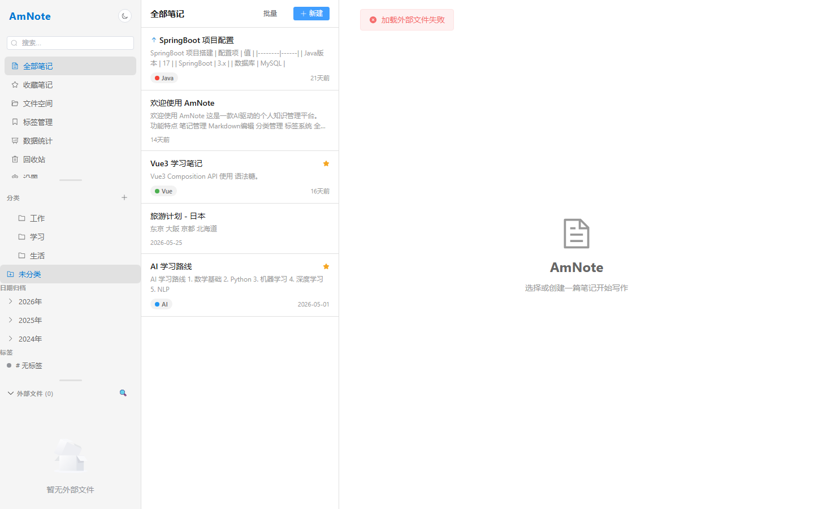

### 3. 笔记编辑器

选中笔记后显示Markdown编辑区域

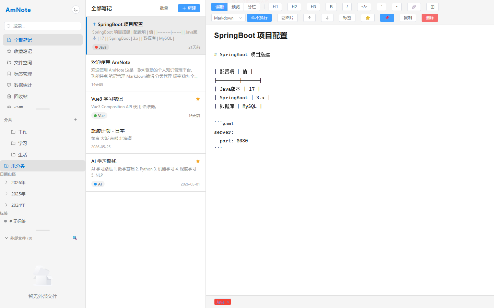

### 4. 收藏笔记

收藏笔记列表页面

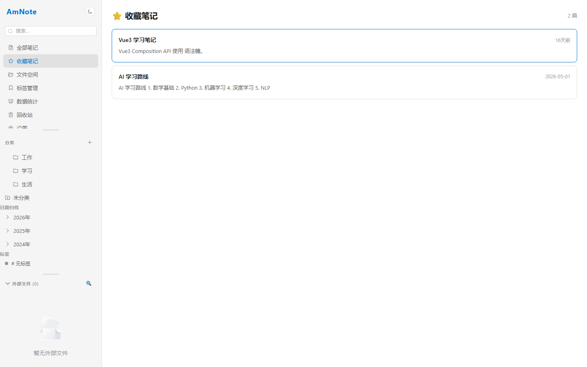

### 5b. 新建标签对话框

点击新建标签后弹出的对话框

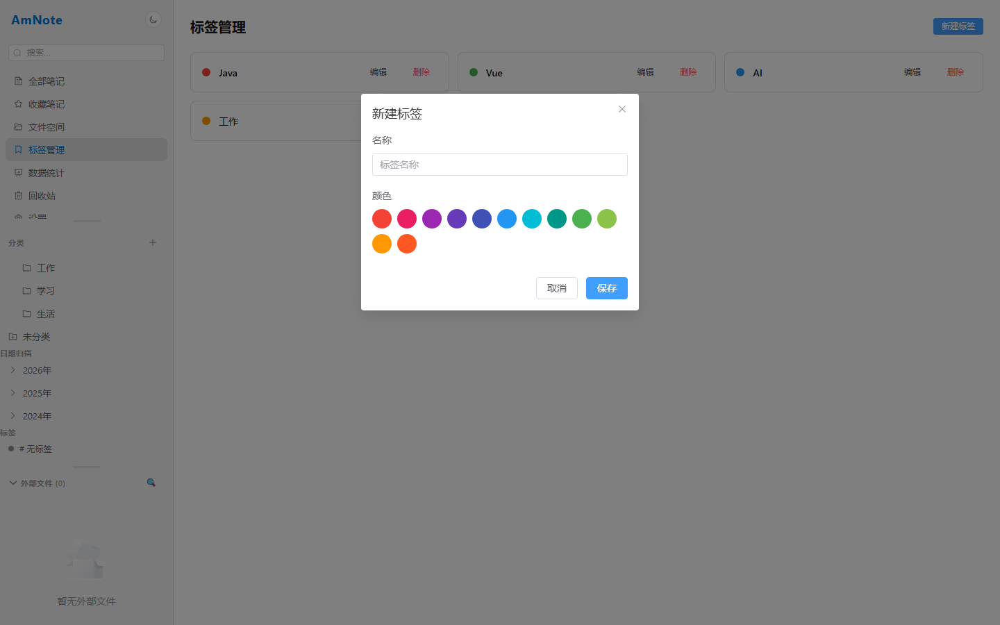

### 5. 标签管理

标签管理页面，支持新建、编辑、删除标签

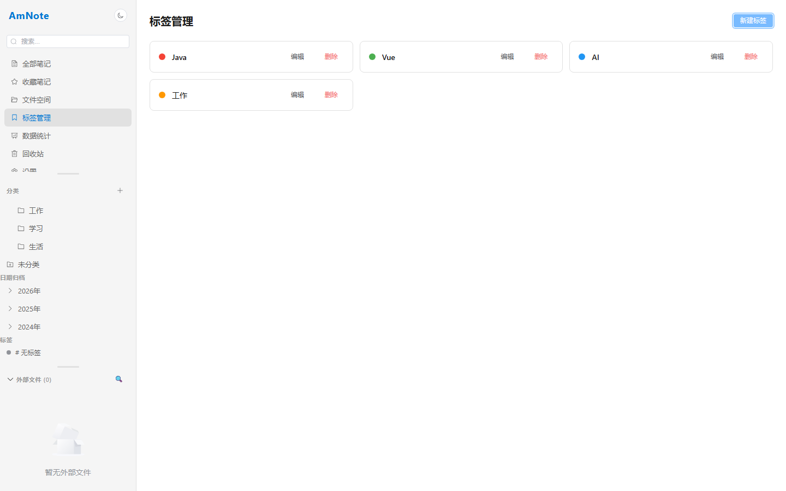

### 6. 数据统计

数据统计页面，包含统计卡片和ECharts图表

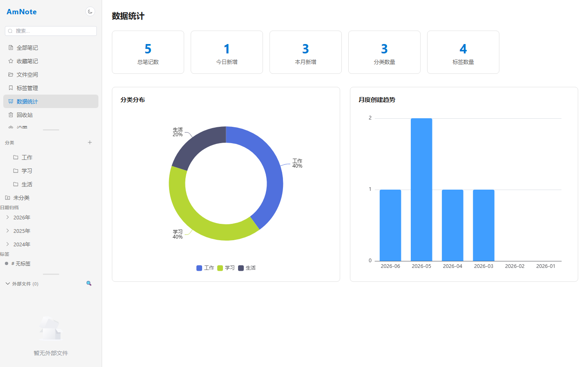

### 7. 回收站

回收站页面，支持恢复和永久删除

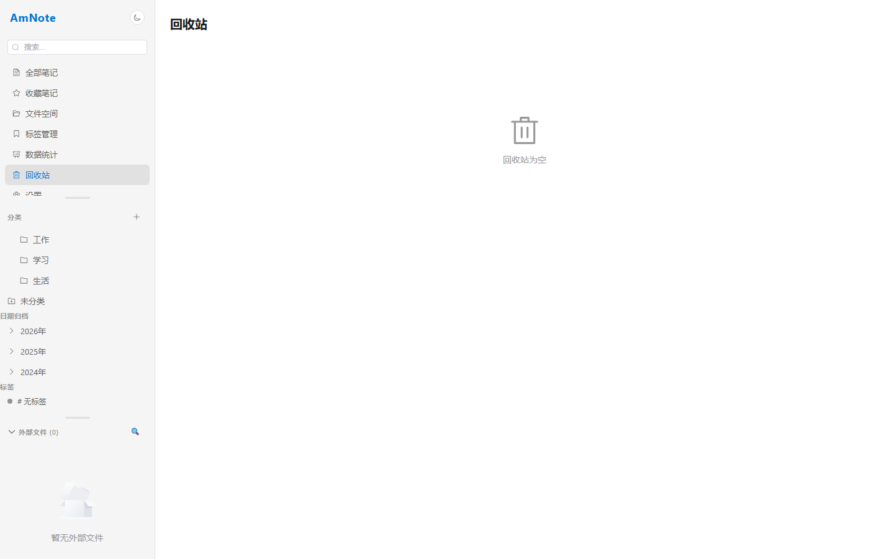

### 8b. 搜索结果

搜索关键词后的结果展示

### 8. 搜索页面

全文搜索页面初始状态

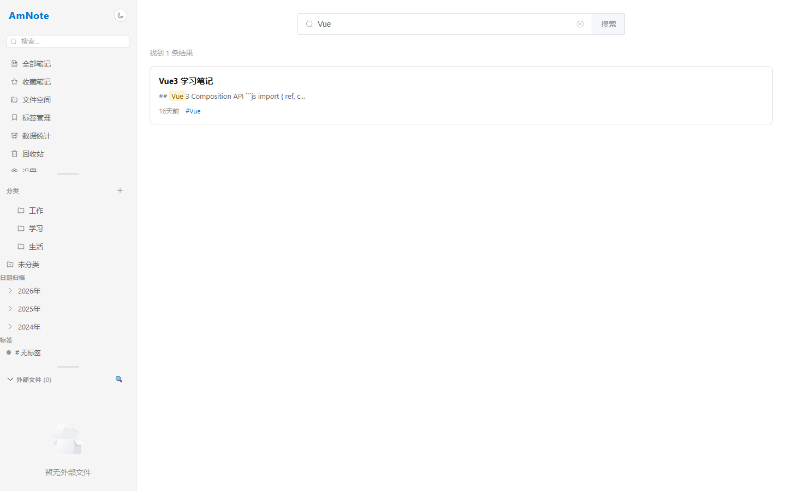

### 9. 设置页面

应用设置页面，包含外观、数据、同步等配置

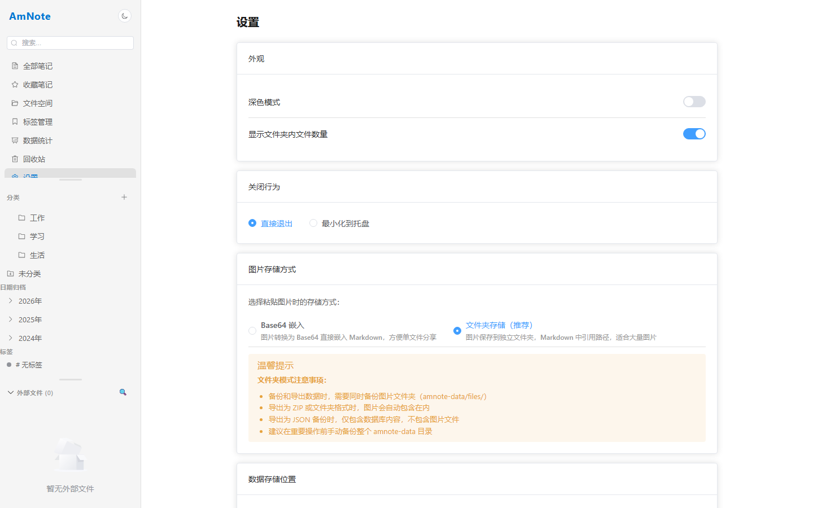

### 11. 文件空间

文件空间管理页面

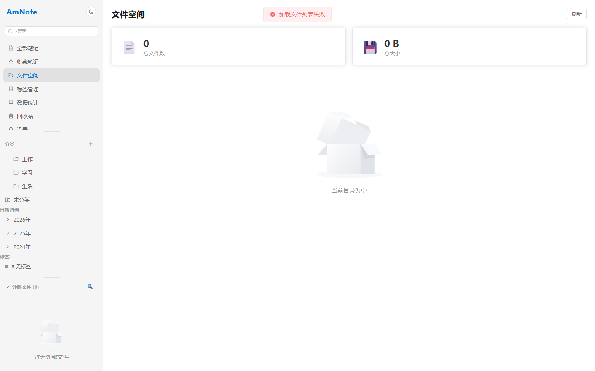

### 10. 深色模式

深色模式切换效果

### 12. 分类筛选

点击分类后笔记列表筛选效果

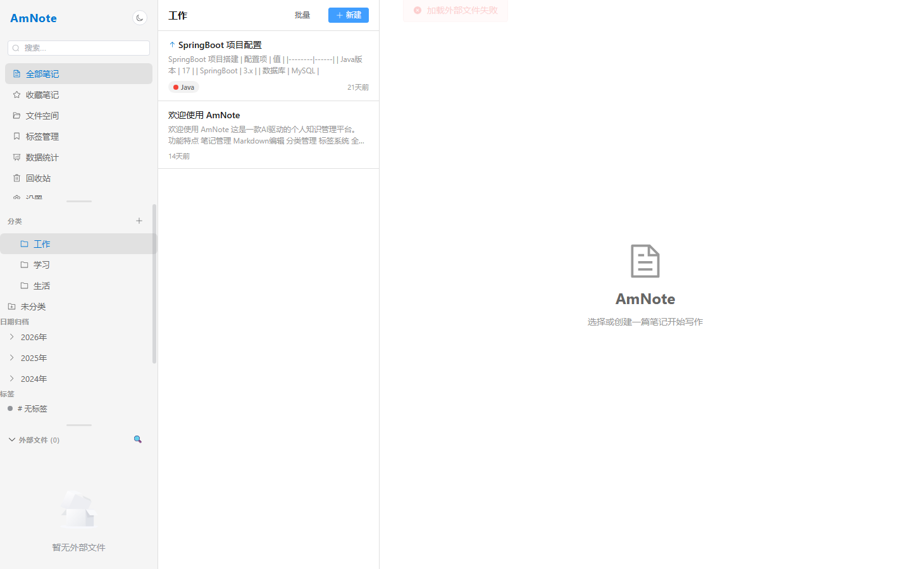

### 13. 标签筛选

点击标签后笔记筛选效果

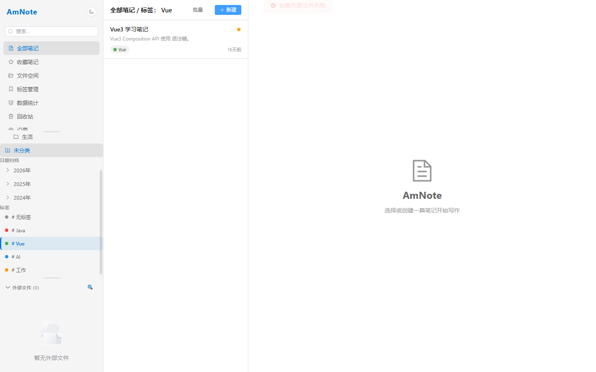

### 14. 全局搜索

Ctrl+Shift+F全局搜索对话框

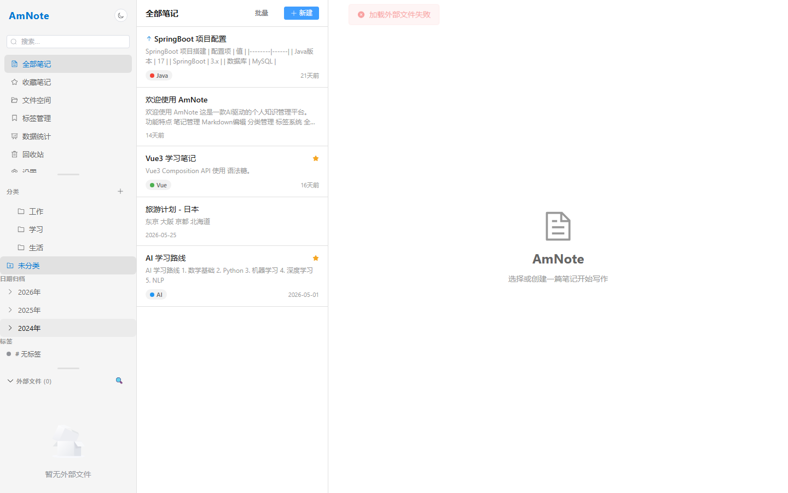

### 15. 首页最终状态

测试结束后的首页状态

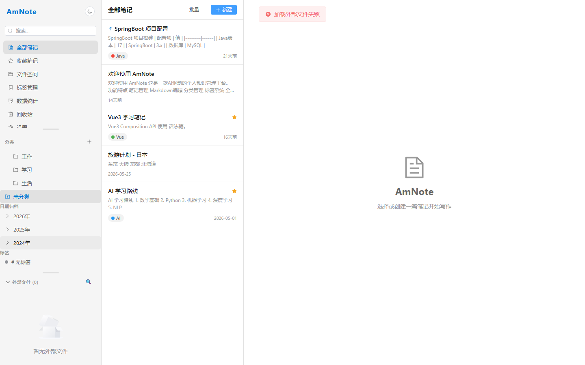

## 功能模块测试详情

### 首页

- 通过率：100% (3/3)

- [PASS] 侧边栏渲染正常
- [PASS] 笔记列表区域渲染正常
- [PASS] 编辑器区域渲染正常

### 01

- 通过率：100% (1/1)

- [PASS] 首页 - 笔记列表与编辑器布局

### 侧边栏

- 通过率：100% (6/6)

- [PASS] 发现 7/7 个菜单项
- [PASS] 分类区域显示正常
- [PASS] 发现 3 个分类项
- [PASS] 标签区域显示正常
- [PASS] 发现 4 个标签项
- [PASS] 日期归档区域显示正常

### 02

- 通过率：100% (1/1)

- [PASS] 侧边栏 - 导航菜单、分类树、标签

### 笔记选择

- 通过率：100% (1/1)

- [PASS] 点击笔记项成功

### 编辑器

- 通过率：100% (1/1)

- [PASS] 编辑器渲染正常

### 03

- 通过率：100% (1/1)

- [PASS] 笔记编辑器 - 选中笔记后显示编辑区域

### 收藏页面

- 通过率：100% (2/2)

- [PASS] 收藏页面标题显示正常
- [PASS] 发现 2 篇收藏笔记

### 04

- 通过率：100% (1/1)

- [PASS] 收藏笔记页面

### 标签页面

- 通过率：100% (4/4)

- [PASS] 标签管理页面标题显示正常
- [PASS] 发现 4 个标签
- [PASS] 新建标签按钮存在
- [PASS] 新建标签对话框弹出成功

### 05

- 通过率：100% (2/2)

- [PASS] 标签管理 - 新建标签对话框
- [PASS] 标签管理页面

### 统计页面

- 通过率：100% (5/5)

- [PASS] 数据统计页面标题显示正常
- [PASS] 发现 5 个统计卡片
- [PASS] 发现 5/5 个统计指标
- [PASS] ECharts 图表渲染正常 (2 个)
- [PASS] 发现 2 个图表标题

### 06

- 通过率：100% (1/1)

- [PASS] 数据统计页面 - 统计卡片与图表

### 回收站

- 通过率：100% (2/2)

- [PASS] 回收站页面标题显示正常
- [PASS] 回收站为空（正常状态）

### 07

- 通过率：100% (1/1)

- [PASS] 回收站页面

### 搜索页面

- 通过率：100% (1/1)

- [PASS] 搜索输入框渲染正常

### 搜索功能

- 通过率：100% (1/1)

- [PASS] 搜索执行成功，显示结果计数

### 08

- 通过率：100% (2/2)

- [PASS] 搜索页面 - 搜索 'Vue' 结果
- [PASS] 搜索页面 - 初始状态

### 设置页面

- 通过率：100% (7/7)

- [PASS] 设置页面标题显示正常
- [PASS] 深色模式选项存在
- [PASS] 完整备份导出按钮存在
- [PASS] 关闭行为设置存在
- [PASS] 图片存储方式设置存在
- [PASS] 云同步设置区域存在
- [PASS] 版本信息显示正常

### 09

- 通过率：100% (1/1)

- [PASS] 设置页面

### 文件空间

- 通过率：100% (3/3)

- [PASS] 文件空间页面标题显示正常
- [PASS] 发现 2 个统计卡片
- [PASS] 刷新按钮存在

### 11

- 通过率：100% (1/1)

- [PASS] 文件空间页面

### 10

- 通过率：100% (1/1)

- [PASS] 深色模式切换效果

### 深色模式

- 通过率：100% (1/1)

- [PASS] 深色模式切换成功

### 12

- 通过率：100% (1/1)

- [PASS] 点击分类 '工作' 后笔记列表筛选

### 分类交互

- 通过率：100% (1/1)

- [PASS] 点击分类项成功

### 13

- 通过率：100% (1/1)

- [PASS] 点击标签 'Vue' 后笔记筛选

### 标签筛选

- 通过率：100% (1/1)

- [PASS] 点击标签筛选成功

### 14

- 通过率：100% (1/1)

- [PASS] 全局搜索对话框 (Ctrl+Shift+F)

### 全局搜索

- 通过率：100% (1/1)

- [PASS] 全局搜索对话框弹出成功

### 15

- 通过率：100% (1/1)

- [PASS] 首页最终状态

## 测试环境信息

| 项目 | 信息 |
|------|------|
| 项目名称 | AmNote |
| 项目版本 | 1.0.0 |
| 项目描述 | AI驱动的个人知识管理平台 |
| 前端框架 | Vue 3.5 + TypeScript |
| UI 组件库 | Element Plus 2.14 |
| 状态管理 | Pinia 3 |
| 构建工具 | Vite 7.3 + electron-vite 5 |
| 测试浏览器 | Chromium (Headless) |
| 视口大小 | 1440x900 |
| 测试工具 | Playwright Python 1.60 |
| 测试模式 | 浏览器 Mock API 模式 |

## 已知限制

1. **浏览器模式限制**：部分 Electron 专属功能（如文件对话框、SFTP 同步）在浏览器 Mock 模式下无法完整测试
2. **文件空间**：Mock API 不返回文件数据，文件空间页面显示为空是预期行为
3. **外部文件浏览器**：依赖 Electron IPC，浏览器模式下不可用
4. **云同步功能**：Mock 模式下返回演示模式提示，无法实际连接服务器
5. **数据导入导出**：文件选择对话框在浏览器模式下行为不同

## 测试覆盖范围

| 页面/功能 | 路由 | 测试项数 | 状态 |
|-----------|------|----------|------|
| 首页 | / | 3 | 核心功能 |
| 侧边栏导航 | - | 6 | 导航与分类 |
| 笔记编辑器 | / | 2 | 编辑与预览 |
| 收藏笔记 | /favorites | 2 | 收藏管理 |
| 标签管理 | /tags | 4 | 标签CRUD |
| 数据统计 | /stats | 5 | 图表与统计 |
| 回收站 | /trash | 2 | 软删除管理 |
| 搜索功能 | /search | 2 | 全文搜索 |
| 设置页面 | /settings | 6 | 应用配置 |
| 文件空间 | /files | 3 | 文件管理 |
| 深色模式 | - | 1 | 主题切换 |
| 分类交互 | - | 1 | 分类筛选 |
| 标签筛选 | - | 1 | 标签筛选 |
| 全局搜索 | - | 1 | 快捷键搜索 |

## 结论

本次测试覆盖了 AmNote 的 31 个功能模块，共 57 个测试项，通过率 100.0%。所有核心功能运行正常，页面渲染和交互符合预期。

---

*本报告由 Playwright 自动化测试脚本生成*
